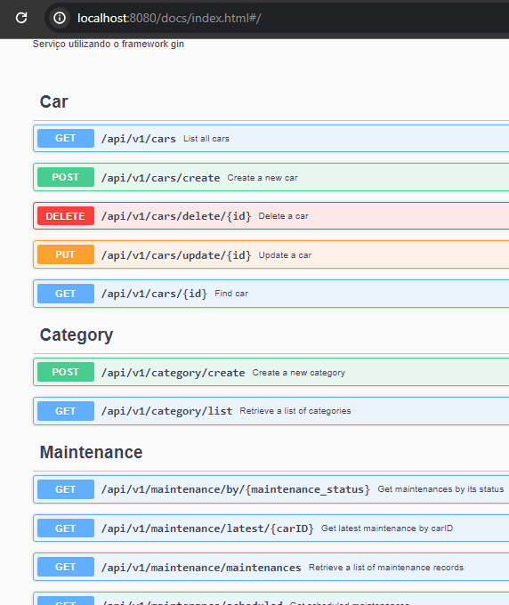

# Car Rental API

Welcome to the Car Rental API repository! 🚗 This project represents my ongoing exploration of REST API development using Golang, with the powerful Gin framework for efficient routing.

## Project Evolution
- **First Iteration:** The journey began with [this repository](https://github.com/Marcosxx1/third-challenge/blob/main/README.md), which was the culmination of my third and final challenge during an internship.

- **Second Iteration:** Building upon the initial experience, I ventured into [another repository](https://github.com/Marcosxx1/Car-Rent-express-node-typescript-/blob/main/README.md) where I implemented the project using Node.js and TypeScript, following the hexagonal architecture.

- **Current Iteration:** Now, we embark on a new adventure with Golang. Despite the similarities with the previous repositories, this (WIP) version aims to be more robust and feature-rich. Leveraging Golang's capabilities for microservices, concurrency, and parallelism, this iteration promises an enhanced and efficient implementation. And is worth noting that this implementation uses middleware data sanitization to prevent CRLF and SQL injections

## Technology Stack
- **Language:** Golang
- **Framework:** Gin
- **Architecture:** Clean Architecture
- **Database:** Explore the Entity-Relationship Diagram (ERD) [here](https://dbdiagram.io/d/car-rent-go-65ad8309ac844320ae6349d4) or you can check the current iteration for the database here: 


Stay tuned for updates as this project evolves into a comprehensive Car Rental API, offering advanced functionalities and leveraging the strengths of Golang. Your feedback and contributions are highly appreciated! 🌟


## Car Rental Architecture Explanation
For this project I chose to follow Clean Architecture, which is a software architectural pattern introduced by Robert C. Martin. Clean Architecture emphasizes the separation of concerns and the independence of the business logic (domain) from the external concerns such as databases, frameworks, and delivery mechanisms.

- **Domain Layer:** Contains the business logic and entities of the application. It represents the core functionality and rules of the system.

- **Application Layer**: Contains use cases or application-specific business rules. It orchestrates the flow of data between the external layers (like the UI and infrastructure) and the domain layer.

- **Infrastructure Layer**: Contains the implementation details and external concerns such as databases, frameworks, and third-party libraries. It's responsible for interacting with external systems.

As well in with the other projects this architecture enables enhanced modularity, testability, and maintainability.


## Table of Contents

- [Installation](#installation)
- [API Endpoints](#api-endpoints)
  - [Authentication](#authentication)
  - [Category](#category)
  - [Car](#car)
  - [Specification](#specification)
  - [Maintenance](#specification)
  - [User](#user)
  - [Orders](#orders)
  - [Reviews](#reviews)
- [Folder Structure](#folder-structure)
- [Contributing](#contributing)
- [Functional Requirements (FR)](#functional-requirements-fr)
- [Non-Functional Requirements (NFR)](#non-functional-requirements-nfr)
- [Business Rules (BR)](#business-rules-br)

## Installation

### Prerequisites
- Go (version 1.2.X)
- PostgreSQL
- Insomnia, Postman, or any similar tool for making HTTP requests

### Clone the Repository
```bash
git clone https://github.com/Marcosxx1/Car-Rent-gin-golang-
cd Car-Rent-gin-golang-
```
```bash
cd Car-Rent-gin-golang-
```
```go
go build
```
This project uses air for live-reloading, after building, in the console just type air
this message should appear:  
```bash
Server running at port: 8080
```

## Swagger
After server initialization Swagger will be avaliable at 
```bash
http://localhost:8080/swagger/index.html#/
```
A quick look:

## API Endpoints

The application offers various API endpoints catering to different functionalities:

### Authentication
With the user created:

- `POST http://localhost:8080/signup`
```json 
{
  "email": "john.doe@example.com",
  "password": "password123"
}

```


## Folder Structure (WIP)
<pre><details>
<summary>Folder structure, click here</summary>
Car-Rent-gin-golang-/
┣ api/
┃ ┣ application/
┃ ┃ ┣ dtos/
┃ ┃ ┃ ┣ auth/
┃ ┃ ┃ ┃ ┗ auth-dtos.go
┃ ┃ ┃ ┣ car/
┃ ┃ ┃ ┃ ┗ car-dto.go
┃ ┃ ┃ ┣ category/
┃ ┃ ┃ ┃ ┗ category-dto.go
┃ ┃ ┃ ┣ maintenance/
┃ ┃ ┃ ┃ ┗ maintenance-dto.go
┃ ┃ ┃ ┣ order/
┃ ┃ ┃ ┃ ┗ orders-dto.go
┃ ┃ ┃ ┣ review/
┃ ┃ ┃ ┃ ┗ review-dtos.go
┃ ┃ ┃ ┣ specification/
┃ ┃ ┃ ┃ ┗ specification-dto.go
┃ ┃ ┃ ┗ user/
┃ ┃ ┃   ┗ user-dto.go
┃ ┃ ┣ repositories/
┃ ┃ ┃ ┣ car-repository.go
┃ ┃ ┃ ┣ category-repository.go
┃ ┃ ┃ ┣ maintenance-repository.go
┃ ┃ ┃ ┣ order-repository.go
┃ ┃ ┃ ┣ reviews-repository.go
┃ ┃ ┃ ┣ specification-repository.go
┃ ┃ ┃ ┗ user-repository.go
┃ ┃ ┣ use-cases/
┃ ┃ ┃ ┣ auth-use-case/
┃ ┃ ┃ ┃ ┣ change-password-use-case.go
┃ ┃ ┃ ┃ ┣ login-use-case.go
┃ ┃ ┃ ┃ ┗ sign-in-use-case.go
┃ ┃ ┃ ┣ car-use-cases/
┃ ┃ ┃ ┃ ┣ car-use-case-tests/
┃ ┃ ┃ ┃ ┃ ┣ car-utils/
┃ ┃ ┃ ┃ ┃ ┃ ┣ car-create-validation.go
┃ ┃ ┃ ┃ ┃ ┃ ┗ car-update-validation.go
┃ ┃ ┃ ┃ ┃ ┣ mocks-and-structs/
┃ ┃ ┃ ┃ ┃ ┃ ┣ mock-car-input.go
┃ ┃ ┃ ┃ ┃ ┃ ┣ mock-car-output.go
┃ ┃ ┃ ┃ ┃ ┃ ┗ mock-car-repository.go
┃ ┃ ┃ ┃ ┃ ┣ delete-car-use-case_test.go
┃ ┃ ┃ ┃ ┃ ┣ get-all-cars-use-case_test.go
┃ ┃ ┃ ┃ ┃ ┣ get-car-by-id-use-case_test.go
┃ ┃ ┃ ┃ ┃ ┗ post-car-use-case_test.go
┃ ┃ ┃ ┃ ┣ delete-car-use-case.go
┃ ┃ ┃ ┃ ┣ get-all-cars-use-case.go
┃ ┃ ┃ ┃ ┣ get-car-by-id-use-case.go
┃ ┃ ┃ ┃ ┣ post-car-use-case.go
┃ ┃ ┃ ┃ ┗ put-car-use-case.go
┃ ┃ ┃ ┣ category-use-cases/
┃ ┃ ┃ ┃ ┣ get-all-categories-use-case.go
┃ ┃ ┃ ┃ ┣ post-category-use-case.go
┃ ┃ ┃ ┃ ┗ post-category-use-case_test.go
┃ ┃ ┃ ┣ maintenance-use-cases/
┃ ┃ ┃ ┃ ┣ maintenance-utils/
┃ ┃ ┃ ┃ ┃ ┣ check-and-set-car-status.go
┃ ┃ ┃ ┃ ┃ ┣ convert-maintenance-to-output-dto.go
┃ ┃ ┃ ┃ ┃ ┣ convert-parts-to-dto.go
┃ ┃ ┃ ┃ ┃ ┣ maintenance-validation.go
┃ ┃ ┃ ┃ ┃ ┗ validate-date-range.go
┃ ┃ ┃ ┃ ┣ delete-maintenance-use-case.go
┃ ┃ ┃ ┃ ┣ get-all-maintenances-use-case.go
┃ ┃ ┃ ┃ ┣ get-latest-maintenance-by-car.go
┃ ┃ ┃ ┃ ┣ get-maintenance-by-car-id-use-case.go
┃ ┃ ┃ ┃ ┣ get-maintenance-by-date-range-use-case.go
┃ ┃ ┃ ┃ ┣ get-maintenance-by-status-use-case.go
┃ ┃ ┃ ┃ ┣ get-scheduled-maintenances-use-case.go
┃ ┃ ┃ ┃ ┣ patch-maintenance-use-case.go
┃ ┃ ┃ ┃ ┗ post-maintenance-use-case.go
┃ ┃ ┃ ┣ order-use-cases/
┃ ┃ ┃ ┃ ┣ delete-order-use-case.go
┃ ┃ ┃ ┃ ┣ get-orders-by-id-and-query-use-case.go
┃ ┃ ┃ ┃ ┗ post-order-use-case.go
┃ ┃ ┃ ┣ reviews-use-cases/
┃ ┃ ┃ ┃ ┣ delete-review-use-case.go
┃ ┃ ┃ ┃ ┣ get-all-reviews-use-case.go
┃ ┃ ┃ ┃ ┣ post-review-use-case.go
┃ ┃ ┃ ┃ ┗ put-review-use-case.go
┃ ┃ ┃ ┣ specification-use-cases/
┃ ┃ ┃ ┃ ┣ post-specification-use-case-test.go
┃ ┃ ┃ ┃ ┗ post-specification-use-case.go
┃ ┃ ┃ ┗ user-use-cases/
┃ ┃ ┃   ┣ user-utils/
┃ ┃ ┃ ┃ ┃ ┗ convert-domain-to-dto.go
┃ ┃ ┃   ┣ get-user-by-id-use-case.go
┃ ┃ ┃   ┗ patch-user-use-case.go
┃ ┃ ┗ utils/
┃ ┃   ┣ convert-specification-to-dto.go
┃ ┃   ┗ parse-maintenance-status.go
┃ ┣ domain/
┃ ┃ ┣ enums/
┃ ┃ ┃ ┗ maintenance-status.enum.go
┃ ┃ ┣ car-maintenance.go
┃ ┃ ┣ car.entity.go
┃ ┃ ┣ category.go
┃ ┃ ┣ claims.go
┃ ┃ ┣ maintenance.go
┃ ┃ ┣ order.go
┃ ┃ ┣ reviews.go
┃ ┃ ┣ specification.go
┃ ┃ ┣ user.go
┃ ┃ ┗ user_car.go
┃ ┗ infra/
┃   ┣ database/
┃ ┃ ┃ ┣ postgres/
┃ ┃ ┃ ┃ ┗ db-config/
┃ ┃ ┃ ┃   ┗ connnection.go
┃ ┃ ┃ ┣ pg-car-repository.go
┃ ┃ ┃ ┣ pg-category-repository.go
┃ ┃ ┃ ┣ pg-maintenance-repository.go
┃ ┃ ┃ ┣ pg-order-repository.go
┃ ┃ ┃ ┣ pg-review-repository.go
┃ ┃ ┃ ┣ pg-specification-repository.go
┃ ┃ ┃ ┗ pg-user-repository.go
┃   ┣ http/
┃ ┃ ┃ ┣ controllers/
┃ ┃ ┃ ┃ ┣ auth-controller/
┃ ┃ ┃ ┃ ┃ ┣ auth/
┃ ┃ ┃ ┃ ┃ ┃ ┗ create-token.go
┃ ┃ ┃ ┃ ┃ ┣ hash-password/
┃ ┃ ┃ ┃ ┃ ┃ ┣ hash-password.go
┃ ┃ ┃ ┃ ┃ ┃ ┗ verify-password.go
┃ ┃ ┃ ┃ ┃ ┣ login.go
┃ ┃ ┃ ┃ ┃ ┗ sign-up.go
┃ ┃ ┃ ┃ ┣ car-controller/
┃ ┃ ┃ ┃ ┃ ┣ delete-car-controller.go
┃ ┃ ┃ ┃ ┃ ┣ get-all-cars-controller.go
┃ ┃ ┃ ┃ ┃ ┣ get-car-by-id-controller.go
┃ ┃ ┃ ┃ ┃ ┣ post-car-controller.go
┃ ┃ ┃ ┃ ┃ ┗ update-car-controller.go
┃ ┃ ┃ ┃ ┣ category-controller/
┃ ┃ ┃ ┃ ┃ ┣ get-all-categories.go
┃ ┃ ┃ ┃ ┃ ┗ post-category.go
┃ ┃ ┃ ┃ ┣ maintenance-controller/
┃ ┃ ┃ ┃ ┃ ┣ delete-maintenance-controller.go
┃ ┃ ┃ ┃ ┃ ┣ get-all-maintenances-controller.go
┃ ┃ ┃ ┃ ┃ ┣ get-latest-maintenance-by-car-controller.go
┃ ┃ ┃ ┃ ┃ ┣ get-maintenance-by-car-id-controller.go
┃ ┃ ┃ ┃ ┃ ┣ get-maintenance-by-date-range-controller.go
┃ ┃ ┃ ┃ ┃ ┣ get-maintenance-by-status-controller.go
┃ ┃ ┃ ┃ ┃ ┣ get-scheduled-maintenances-controller.go
┃ ┃ ┃ ┃ ┃ ┣ patch-maintenance-controller.go
┃ ┃ ┃ ┃ ┃ ┗ post-maintenance-controller.go
┃ ┃ ┃ ┃ ┣ order-controller/
┃ ┃ ┃ ┃ ┃ ┣ delete-order-controller.go
┃ ┃ ┃ ┃ ┃ ┣ get-orders-by-id-and-query-controller.go
┃ ┃ ┃ ┃ ┃ ┗ post-order-controller.go
┃ ┃ ┃ ┃ ┣ review-controller/
┃ ┃ ┃ ┃ ┃ ┣ delete-review-controller.go
┃ ┃ ┃ ┃ ┃ ┣ get-all-reviews-controller.go
┃ ┃ ┃ ┃ ┃ ┣ post-review-controller.go
┃ ┃ ┃ ┃ ┃ ┗ put-review-controller.go
┃ ┃ ┃ ┃ ┣ specification-controller/
┃ ┃ ┃ ┃ ┃ ┗ post-specification-controller.go
┃ ┃ ┃ ┃ ┗ user-controller/
┃ ┃ ┃ ┃   ┣ change-passwor-controller.go
┃ ┃ ┃ ┃   ┣ get-user-by-id-controller.go
┃ ┃ ┃ ┃   ┗ patch-user-controller.go
┃ ┃ ┃ ┣ docs/
┃ ┃ ┃ ┃ ┣ setup-docs-routes/
┃ ┃ ┃ ┃ ┃ ┗ setup-docs-route.go
┃ ┃ ┃ ┃ ┣ docs.go
┃ ┃ ┃ ┃ ┣ swagger.json
┃ ┃ ┃ ┃ ┗ swagger.yaml
┃ ┃ ┃ ┣ factories/
┃ ┃ ┃ ┃ ┣ auth/
┃ ┃ ┃ ┃ ┃ ┣ login.go
┃ ┃ ┃ ┃ ┃ ┗ signup.go
┃ ┃ ┃ ┃ ┣ car/
┃ ┃ ┃ ┃ ┃ ┣ delete-car-controller-factory.go
┃ ┃ ┃ ┃ ┃ ┣ get-all-cars-controller-factory.go
┃ ┃ ┃ ┃ ┃ ┣ get-car-by-id-controller-factory.go
┃ ┃ ┃ ┃ ┃ ┣ post-car-controller-factory.go
┃ ┃ ┃ ┃ ┃ ┗ update-car-controller-factory.go
┃ ┃ ┃ ┃ ┣ category/
┃ ┃ ┃ ┃ ┃ ┣ get-all-categories-factory.go
┃ ┃ ┃ ┃ ┃ ┗ post-category-factory.go
┃ ┃ ┃ ┃ ┣ maintenance/
┃ ┃ ┃ ┃ ┃ ┣ delete-maintenance-controller-factory.go
┃ ┃ ┃ ┃ ┃ ┣ get-all-maintenances-controller-factory.go
┃ ┃ ┃ ┃ ┃ ┣ get-latest-maintenance-by-car-controller-factory.go
┃ ┃ ┃ ┃ ┃ ┣ get-maintenance-by-car-id-controller-factory.go
┃ ┃ ┃ ┃ ┃ ┣ get-maintenance-by-date-range-controller-factory.go
┃ ┃ ┃ ┃ ┃ ┣ get-maintenance-by-status-controller-factory.go
┃ ┃ ┃ ┃ ┃ ┣ get-scheduled-maintenances-controller-factory.go
┃ ┃ ┃ ┃ ┃ ┣ patch-maintenance-controller-factory.go
┃ ┃ ┃ ┃ ┃ ┗ post-maintenance-controller-factory.go
┃ ┃ ┃ ┃ ┣ orders/
┃ ┃ ┃ ┃ ┃ ┣ delete-order-controller-factory.go
┃ ┃ ┃ ┃ ┃ ┣ get-orders-by-id-and-query-controller-factory.go
┃ ┃ ┃ ┃ ┃ ┗ post-order-controller-factory.go
┃ ┃ ┃ ┃ ┣ reviews/
┃ ┃ ┃ ┃ ┃ ┣ delete-review-controller-factory.go
┃ ┃ ┃ ┃ ┃ ┣ get-all-reviews-controller-factory.go
┃ ┃ ┃ ┃ ┃ ┣ post-review-controller-factory.go
┃ ┃ ┃ ┃ ┃ ┗ update-review-controller-factory.go
┃ ┃ ┃ ┃ ┣ specification/
┃ ┃ ┃ ┃ ┃ ┗ post-specification-controller-factory.go
┃ ┃ ┃ ┃ ┗ user/
┃ ┃ ┃ ┃   ┣ change-passwor-controller-controller-factory.go
┃ ┃ ┃ ┃   ┣ get-user-by-id-controller-factory.go
┃ ┃ ┃ ┃   ┗ patch-user-controller-controller-factory.go
┃ ┃ ┃ ┣ middlewares/
┃ ┃ ┃ ┃ ┣ get-id.go
┃ ┃ ┃ ┃ ┗ sanitization.go
┃ ┃ ┃ ┣ setup-routes/
┃ ┃ ┃ ┃ ┣ routes/
┃ ┃ ┃ ┃ ┃ ┣ auth-routes.go
┃ ┃ ┃ ┃ ┃ ┣ car-rotues.go
┃ ┃ ┃ ┃ ┃ ┣ category-routes.go
┃ ┃ ┃ ┃ ┃ ┣ maintenance-routes.go
┃ ┃ ┃ ┃ ┃ ┣ order-routes.go
┃ ┃ ┃ ┃ ┃ ┣ review-routes.go
┃ ┃ ┃ ┃ ┃ ┣ specification-routes.go
┃ ┃ ┃ ┃ ┃ ┗ user-routes.go
┃ ┃ ┃ ┃ ┗ setup-routes.go
┃ ┃ ┃ ┗ main.go
┃   ┗ validation_errors/
┃ ┃   ┣ error.go
┃ ┃   ┗ validator.go
┣ tmp/
┃ ┣ build-errors.log
┃ ┗ main.exe
┣ .air.toml
┣ .env
┣ .gitignore
┣ go.mod
┣ go.sum
┣ image.png
┗ README.md
</details>
</pre>

# Unit Testing Roadmap

## Introduction 
- I will understand the importance of unit testing
- I will Learn the basics of unit testing in Go
- I will Set up a testing environment


## Writing Unit Tests (WIP)
- Identify the unit of work (function, method, package)
- Define the test case scenarios (happy path, edge cases, error cases)
- Write test functions using `t.Run` or `t.Helper` to group tests
- Use assertions to validate expected outcomes (`assert.Equal`, `assert.Nil`, `assert.NotNil`)

## Test Coverage
- Monitor test coverage using tools like `go test -cover`
- Aim for high test coverage to ensure comprehensive testing
- Identify and write tests for uncovered areas

## Mocking and Stubbing
- Understand the need for mocking and stubbing in unit testing
- Use libraries like `testify/mock` or hand-crafted mocks to simulate dependencies
- Mock external dependencies (e.g., databases, APIs) to isolate unit tests

## Running Tests
- Run tests using `go test ./...` to execute all tests in the package and sub-packages
- Use flags like `-v` for verbose output and `-run` to filter tests
- Analyze test results and fix failures

## Best Practices
- Write descriptive test names to document intent
- Keep tests isolated, independent, and repeatable
- Refactor and maintain tests as the codebase evolves

## Continuous Integration (CI)
- Integrate tests into CI pipelines (e.g., GitHub Actions, Jenkins)
- Automate test execution on code commits and pull requests
- Monitor CI results and address failures promptly

## Conclusion
- Celebrate successes and learn from failures
- Continuously improve testing skills and practices
- Encourage team collaboration and knowledge sharing on testing


## Functional Requirements (FR)
### Implemented := :white_check_mark:
### WIP := :o:
### Car Registration
- Ability to register a new car. :white_check_mark:
- Car registration requires attributes like make, model, and year. :white_check_mark:
- Cars are registered with an availability status by default. :white_check_mark:
- Car registration limited to administrators. :white_check_mark:

### Car Listing
- Ability to list all available cars. :white_check_mark:
- Users can filter available cars by category, manufacturer, and name. :o:
- User authentication not required for listing all cars.  :white_check_mark:
### Car Specification Registration
- It should be possible to register specifications for a car. :white_check_mark:
- Specifications could include engine type, fuel efficiency, etc. :white_check_mark:
- Specifications must not be registered for non-existing cars. :white_check_mark:
- Users should be administrators to register car specifications. :o:
- It should be possible to list all specifications. :white_check_mark:
- It should be possible to list all cars along with their specifications. :white_check_mark:

### Car Image Registration
- It must be possible to register images for cars. :o:
- Users can upload more than one image for the same car. :o:
- Users responsible for registration should be administrators. :o:
- Multer should be used to handle image uploads. :o:
- It should be possible to list all cars along with their images. :o:

### Car Order
- It should be possible to register a car Order. :white_check_mark:
- Car Order details should include start date, end date, user ID, etc. :o:
- Orders must be for a minimum of 24 hours. :o:
- Users should not be able to register a new Order if they already have one. :o:
- Users should not be able to register a new Order for a car that is already rented. :o:

### Payments
#### Make Payment:

- Ability to process a payment for an order. :o:
- Payment details should include payment date, payment amount, and payment status. :o:
  
#### Get Payment by ID:
- Ability to retrieve details of a specific payment by ID. :o: 

### Reviews
#### Create Review:

- Ability to create a new review. :white_check_mark:
- Ability to retrieve all avaliable reviews :white_check_mark:
- Review details should include user ID, car ID, rating, and comment. :white_check_mark:
- Ability to retrieve details of a specific review by ID. :white_check_mark:
- Ability to update information for a specific review. :white_check_mark:
- Ability to delete a specific review. :white_check_mark:

## Non-Functional Requirements (NFR)

- Validation mechanisms ensure accurate user inputs. 
- Robust error handling enhances user experience.
- User authentication and authorization ensure secure operations.
- Comprehensive documentation covers codebase, APIs, and setup.
- Focus on performance, security, and scalability enhances application quality.

## Business Rules (BR)

### Car Registration
- Prevent car registration with an existing license plate. :white_check_mark:
- Disallow changing license plates of already registered cars. :o:
- Register cars with an availability status by default. :white_check_mark:
- Only administrators can perform car registration.  :o:

### Car Specification Registration
- Specifications must not be registered for non-existing cars. :white_check_mark:
- Registering the same specification for the same car should not be allowed. :o:
- Only administrators can register car specifications.  :o:

### Car Image Registration
- Users can upload multiple images for the same car.  :o:
- Users responsible for registration should be administrators.  :o:


 
## Contributing

Contributions are welcome! Feel free to open issues or submit pull requests for improvements or bug fixes.

The Car Rental App's architecture provides clarity, modularity, and scalability. This documentation offers insights into installation, usage, functionalities, and requirements, fostering a better understanding of the application's ecosystem.


###swagoo:
 swag init --parseDependency --parseInternal due to package problems      

 docker build -t car-rent-go .

 docker pull postgres

 docker run --name car-rent-go -e POSTGRES_PASSWORD=postgres -e POSTGRES_DB=car-rent-go -d postgres

docker run --link car-rent-go:postgres car-rent-go


docker run --name car-rent-postgres -e POSTGRES_PASSWORD=postgres -e POSTGRES_DB=car-rent-go -d postgres

docker exec -it car-rent-postgres psql -U postgres

CREATE DATABASE car_rent_go;
